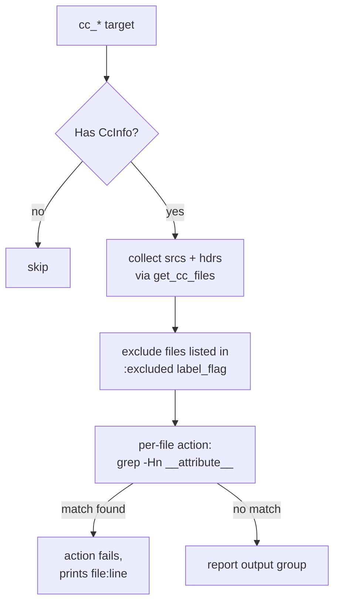

# check_attributes

A Bazel [aspect](https://bazel.build/extending/aspects) that bans raw
`__attribute__(...)` in C/C++ sources. Compiler-specific attributes must
instead go behind guard macros defined in one central header —
`libswiftnav/macros.h`, included as `swiftnav/macros.h` — so the codebase has
a single, greppable place to handle compiler differences (GCC vs. Clang vs.
MSVC, version quirks, etc.) instead of `__attribute__` sprinkled throughout
production code.

When the check fires, the reported error points at that header:

```
error: Do not use __attribute__, prefer one of the macros from swiftnav/macros.h
```

## How it works

`check_attributes` (defined in `check_attributes.bzl`) attaches to existing
`cc_*` targets — it is an aspect, not a rule, so no `BUILD` file changes are
required to use it.



- Targets without `CcInfo` (i.e. non-C/C++ targets) are skipped.
- Source files are collected the same way as the rest of the `cc_files` tooling:
  only `srcs` and `hdrs`, and only files that are actually sources (generated
  files are not scanned).
- Each file is checked with a `grep -Hn __attribute__`; any match fails the
  action and prints the offending `file:line`.
- Successful checks are collected into an output group named `report`.

## Usage

Run the aspect over whichever targets you want checked:

```bash
bazel build \
  --aspects @rules_swiftnav//check_attributes:check_attributes.bzl%check_attributes \
  --output_groups=report \
  //...
```

The aspect has no `attr_aspects`, so it does **not** propagate into dependencies
automatically — pass the target pattern(s) you want covered (e.g. `//...` for
the whole repo, or a narrower package).

To make this a one-word command, add a config to `.bazelrc`:

```
build:check-attributes --aspects @rules_swiftnav//check_attributes:check_attributes.bzl%check_attributes
build:check-attributes --output_groups=report
```

and then run:

```bash
bazel build --config=check-attributes //...
```

## Excluding files
`//check_attributes:excluded` is a `label_flag` (default: an empty
`filegroup`) that lists files the check should skip entirely. The primary
entry is `libswiftnav/macros.h` itself, which by definition contains the raw
`__attribute__` uses that every other file is expected to go through.

Override it with a `filegroup` of your own:

```python
# in your BUILD file
filegroup(
    name = "attribute_exceptions",
    srcs = ["//libswiftnav:macros.h"],
)
```

```bash
bazel build \
  --aspects @rules_swiftnav//check_attributes:check_attributes.bzl%check_attributes \
  --output_groups=report \
  --@rules_swiftnav//check_attributes:excluded=//path/to:attribute_exceptions \
  //...
```

Matching is by exact `File` identity (against `ctx.files._excluded`), not by
glob or path prefix — list every file that needs to be exempted.

## Writing compliant code

Instead of using a compiler attribute directly:

```c
// rejected by check_attributes
void legacy_helper(void) __attribute__((unused));
```

route it through a macro defined in `libswiftnav/macros.h`:

```c
// libswiftnav/macros.h
#if defined(__GNUC__) || defined(__clang__)
#define MY_ATTR_UNUSED __attribute__((unused))
#else
#define MY_ATTR_UNUSED
#endif
```

```c
// consumer.c
#include <swiftnav/macros.h>

void legacy_helper(void) MY_ATTR_UNUSED;
```

(`MY_ATTR_UNUSED` is illustrative — use the naming convention
`libswiftnav/macros.h` already follows.)

Rule of thumb for adding a new macro:

1. Add it to `libswiftnav/macros.h`; do not define compiler-attribute macros
   in individual modules.
2. Guard it on the compiler (and version, if needed).
3. Provide a no-op fallback for compilers that don't support it.
4. Only add a file to the exclusion `filegroup` if it must legitimately
   contain a raw attribute — in practice that is only
   `libswiftnav/macros.h`.

## Limitations / known issues

- Detection is a plain `grep -Hn __attribute__` with no preprocessing, so it
  also flags matches inside comments and string literals.
- The action's `tee {output}` call (not `tee -a`) overwrites rather than appends
  on each iteration, so if multiple matches are found the `report` artifact ends
  up containing only the last one. The actionable diagnostics come from the
  action's console output, not from reading the artifact.
- Because the action exits non-zero on any match, the `report` artifact is never
  produced for a failing file — there is nothing to inspect after the build
  fails other than the build log.
- The output file path is derived by appending `.check-attributes.txt` to the
  input file's path, which can produce oddly nested artifact paths.
- The aspect declares `fragments = ["cpp"]` and a dependency on the C++
  toolchain, but the current implementation doesn't use either.
- Only the literal token `__attribute__` is detected. Other compiler-specific
  mechanisms — `__declspec`, `#pragma`, C++11 `[[...]]` attributes — are not
  caught by this check.

## Related

- `cc_files/get_cc_files.bzl` — shared helper this aspect uses to enumerate a
  target's sources and headers.
- `tools/lint/lint.sh` — another aspect-based check in this repo, built on
  `@aspect_rules_lint`.
