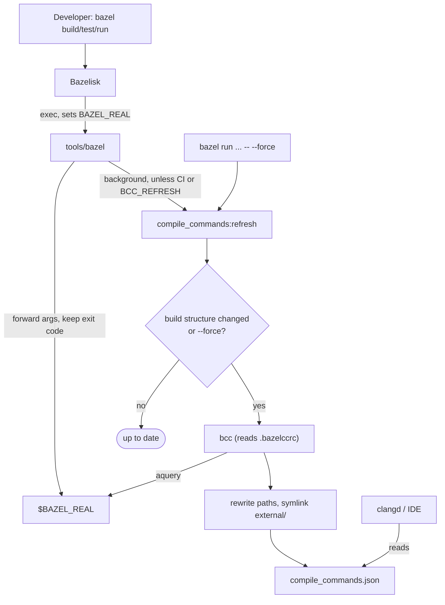

# Automatic `compile_commands.json` Generation

Keeps `compile_commands.json` up to date on every developer machine of a
repository depending on `rules_swiftnav`, without manual steps. The only
per-machine prerequisite is Bazelisk.

## Setup in a Downstream Repository

Requirements: the workspace is inside a git repository and Bazel is invoked via
Bazelisk.

1. Copy [`.bazelccrc`](.bazelccrc) to the workspace root.
2. Copy [`bazel_wrapper.sh`](bazel_wrapper.sh) to `tools/bazel` in the
   workspace root and commit it with the executable bit set
   (`git update-index --chmod=+x tools/bazel`).
3. Add to `.gitignore`:

   ```gitignore
   /compile_commands.json
   /external
   /.cache/
   ```

Re-copy both files when upgrading `rules_swiftnav` if they changed.

Manual, forced regeneration, e.g. from a `Makefile`:

```bash
bazel run @rules_swiftnav//compile_commands:refresh -- --force
```

`examples/small_world` is a working example.

## How It Works

Generation uses [kiron1/bazel-compile-commands](https://github.com/kiron1/bazel-compile-commands)
(`bcc`). Bazelisk runs `tools/bazel` instead of Bazel; after a `build`, `test`
or `run` the wrapper starts `@rules_swiftnav//compile_commands:refresh` in the
background. The wrapper forwards output and exit code of Bazel unchanged.



`refresh` regenerates the database only if the build structure changed since the
last run. It hashes the names and contents of `BUILD`, `BUILD.bazel`, `*.bzl`,
`*.bazelrc`, `toolchains/**`, `.bazelrc`, `.bazeliskrc`, `.bazelccrc`,
`MODULE.bazel`, `MODULE.bazel.lock` and `.bazelrc.user`, plus the names (not
contents) of C/C++ sources and headers. Concurrent runs are serialized through a
lock in `.cache/`; background output goes to `.cache/compile_commands.log`.

`bcc` emits paths relative to the execution root. `refresh` rewrites them to the
workspace and symlinks `<workspace>/external` to `<output_base>/external`, so
external headers stay reachable for clangd.

## Notes

- The wrapper does nothing if `CI` is set. `BAZELISK_SKIP_WRAPPER=1` bypasses it
  entirely.
- `.bazelccrc` deliberately has no `config` entries: `aquery` must use the
  default build flags, otherwise it discards Bazel's analysis cache of regular
  builds. For the same reason `refresh` runs with default flags, even after a
  `--config=X` build.
- The `bcc` and `refresh` targets are tagged `manual` so that `//...` stays
  buildable for cross-compilation platforms without a prebuilt `bcc` binary.
- `--force` waits up to `BCC_LOCK_TIMEOUT` seconds (default 600) for a running
  refresh and exits 1 on timeout.
