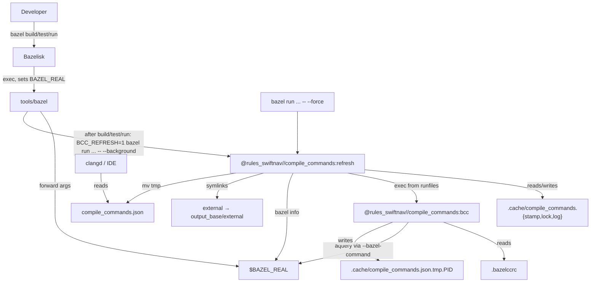
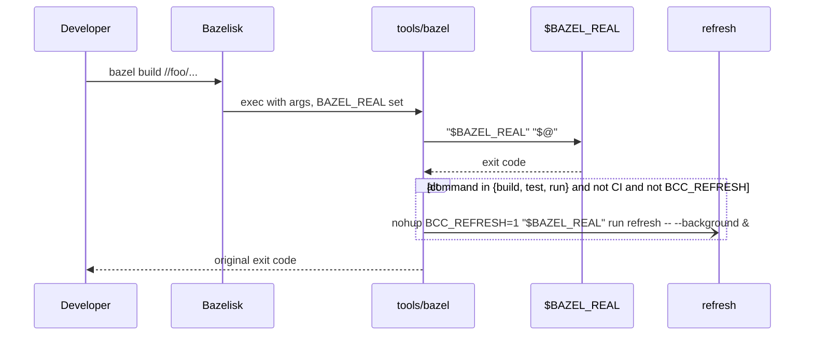
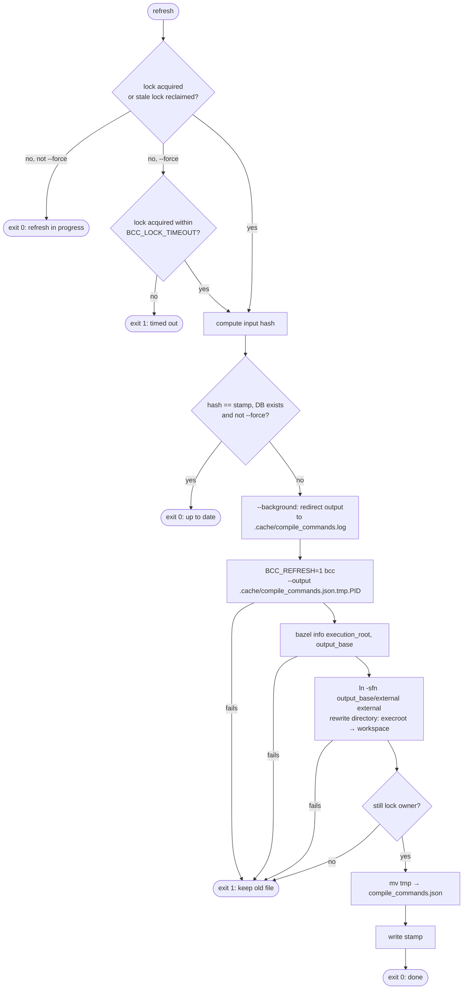

# Automatic `compile_commands.json` Generation

## Goal

Keep `compile_commands.json` up to date on every developer machine of a
repository depending on `rules_swiftnav`, without manual steps. All tooling
versions and trigger logic are versioned; the only per-machine prerequisite is
Bazelisk.

## Non-Goals

- Git hooks (`post-checkout`, `post-merge`, ...).
- Generating the database in CI.
- A cppcheck-specific compile commands database.

## Setup in a Downstream Repository

Requirements: the workspace is inside a git repository and Bazel is invoked via
Bazelisk.

1. Copy [`.bazelccrc`](.bazelccrc) to the workspace root.
2. Copy [`bazel_wrapper.sh`](bazel_wrapper.sh) to `tools/bazel` in the
   workspace root and commit it with the executable bit set
   (`git update-index --chmod=+x tools/bazel`).
3. Add to `.gitignore`:

   ```gitignore
   /compile_commands.json
   /external
   /.cache/
   ```

Re-copy both files when upgrading `rules_swiftnav` if they changed.

Manual, forced regeneration, e.g. from a `Makefile`:

```bash
bazel run @rules_swiftnav//compile_commands:refresh -- --force
```

`examples/small_world` is a working example.

## Design

Generation uses [kiron1/bazel-compile-commands](https://github.com/kiron1/bazel-compile-commands)
(`bcc`). Regeneration is triggered automatically through a Bazelisk wrapper.

### Components

| Component | Location | Responsibility |
|---|---|---|
| `bcc` binary | Swift bazel registry | Runs `bazel aquery`, writes the compile commands database |
| `@rules_swiftnav//compile_commands:bcc` | `compile_commands/BUILD.bazel` | `native_binary` selecting the prebuilt binary for the host (macOS universal, Linux x86_64/aarch64); tagged `manual` |
| `@rules_swiftnav//compile_commands:refresh` | `compile_commands/BUILD.bazel`, `refresh.sh` | Staleness check, locking, path rewriting, atomic write; gets `bcc` from runfiles |
| `.bazelccrc` | downstream workspace root, template in `compile_commands/` | Shared `bcc` defaults: `output`, `resolve`, `targets` |
| `tools/bazel` | downstream workspace root, template `compile_commands/bazel_wrapper.sh` | Bazelisk wrapper; triggers `refresh` after relevant commands |

Both targets are `manual` so that `//...` stays buildable for cross-compilation
platforms without a prebuilt `bcc` binary.

`.bazelccrc` deliberately has no `config` entries: `aquery` must use the default
build flags, otherwise it discards Bazel's analysis cache of regular builds.

### Relationships



### Wrapper Flow

Bazelisk executes `tools/bazel` instead of Bazel if it exists and is executable.
The real binary is exposed via `BAZEL_REAL`.



Wrapper rules:

- Forward stdout, stderr, and exit code unchanged; the wrapper prints nothing
  itself. The background refresh is detached from the terminal and logs to
  `.cache/compile_commands.log`.
- The command is the first argument not starting with `-`; startup options
  always use the `--flag=value` form.
- Act only on an allow-list of commands (`build`, `test`, `run`).
- Skip when `CI` is set or `BCC_REFRESH` is set (recursion guard).
- `BAZELISK_SKIP_WRAPPER=1` bypasses the wrapper entirely.

### Refresh Flow

`refresh.sh` only runs via `bazel run`: the workspace is taken from
`BUILD_WORKSPACE_DIRECTORY`, `bcc` from the runfiles.



When `BAZEL_REAL` is set (inherited from the wrapper), `refresh.sh` uses it for
all Bazel calls and passes it to `bcc` via `--bazel-command`. Otherwise it calls
`bazel`, which re-enters the wrapper and is stopped by `BCC_REFRESH=1`.

### Path Rewriting

`bcc` emits paths relative to the execution root, whose `external/` symlink
forest only holds the repositories of the last build. `refresh.sh` therefore:

- rewrites every `"directory"` entry from the execution root to the workspace,
- symlinks `<workspace>/external` to `<output_base>/external`, so all external
  headers stay reachable.

`resolve = 1` in `.bazelccrc` only rewrites the `file` entries, not the
arguments.

### Locking

- `.cache/compile_commands.lock` is a symlink whose target is the owner pid.
  `symlink(2)` is atomic and creates lock and owner in one step.
- A lock without a live numeric owner (dead pid, unreadable target, leftover
  directory) is stale. Reclaimers atomically rename it aside before removing it,
  so only one of several concurrent reclaimers wins.
- Each run writes to its own `compile_commands.json.tmp.<pid>` and re-checks lock
  ownership before the final `mv`.
- Non-forced runs exit 0 when the lock is held. `--force` waits up to
  `BCC_LOCK_TIMEOUT` seconds (default 600) and exits 1 on timeout.

### Staleness Inputs

The database depends on build structure, not on source file contents. Files are
listed with `git ls-files --cached --others --exclude-standard` relative to the
workspace, so untracked but not ignored files count. The hash covers:

- Names and contents of structure files: `BUILD`, `BUILD.bazel`, `*.bzl`,
  `*.bazelrc`, `toolchains/**`, `.bazelrc`, `.bazeliskrc`, `.bazelccrc`,
  `MODULE.bazel`, `MODULE.bazel.lock`. The `rules_swiftnav` and `bcc` versions
  are part of `MODULE.bazel`.
- `.bazelrc.user`, if present (gitignored, added explicitly).
- Names only of C/C++ sources and headers (`*.c`, `*.cc`, `*.cpp`, `*.cxx`,
  `*.h`, `*.hh`, `*.hpp`, `*.hxx`, `*.inc`, `*.ipp`).

## Constraints and Risks

| Risk | Mitigation |
|---|---|
| `bazel run refresh` uses default flags: after a `--config=X` build it discards Bazel's analysis cache of that build | Accepted trade-off. Builds with default flags are unaffected |
| `aquery` with flags differing from regular builds discards Bazel's analysis cache | `.bazelccrc` sets no `config`, so `aquery` uses the default build flags |
| Recursion: `bcc` calls `bazel`, which re-enters the wrapper | `BCC_REFRESH=1` guard, and `bcc` uses `$BAZEL_REAL` via `--bazel-command` when available |
| Background refresh contends for the Bazel server lock | Short analysis of `refresh`; lock plus stamp check keeps `bcc` runs rare |
| Generated headers missing for clangd | Refresh runs after `build`, so generated files already exist |
| Cross-compilation toolchains produce flags clangd cannot use | Generate for the default (host) config; targets are `manual` so `//...` builds for other platforms |
| Developers bypassing Bazelisk get no automatic refresh | Manual `bazel run ... -- --force` remains |
| Downstream wrapper and `.bazelccrc` copies drift from templates | Templates versioned here; re-copy on upgrade |
| Refresh killed mid-run leaves a lock behind | Stale locks without a live owner are reclaimed automatically |

## Open Points

- Optional IDE integration (`bazel-clangd-wrapper`, `.vscode/tasks.json`).
- Pid reuse: a dead lock owner's pid reused by an unrelated process makes the
  lock look live. Forced runs then time out with exit 1.
